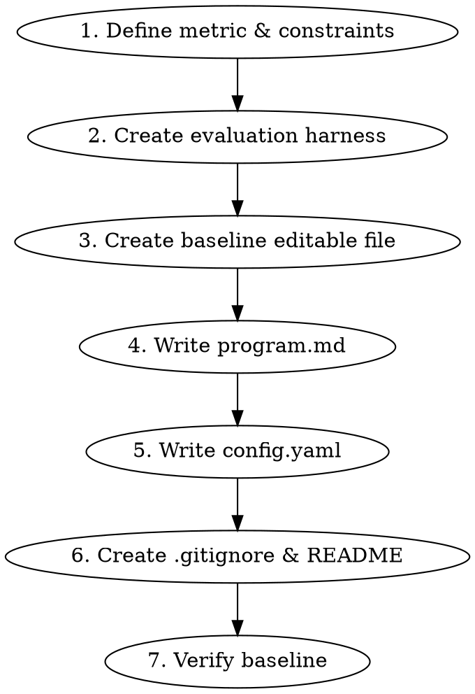

# Crucible Project Setup

Scaffold a complete crucible experiment project — config, agent instructions, editable code, and evaluation harness — so the platform can run an autonomous optimization loop.

## When to Use

- User wants to optimize something (sorting speed, model accuracy, inference latency, etc.)
- User wants to set up a new crucible experiment
- User describes a metric they want to improve automatically

## Quick Start Option

If the user's task is similar to an existing example, suggest using the CLI first:

```bash
crucible new . --list                          # see available examples
crucible new ~/my-project -e optimize-sorting  # create from example
```

Examples: `optimize-sorting`, `optimize-regression`, `optimize-classifier`, `optimize-gomoku`, `optimize-compress`, `optimize-lm`

If no example fits, proceed with the workflow below to build from scratch.

## Project Structure

Every crucible project has exactly this structure:

```
project-root/
  .crucible/
    config.yaml      # What to optimize, how to run, what to measure
    program.md       # Instructions for the LLM agent (MUST be readonly)
  <editable>.py      # Code the agent modifies (the "knob")
  <evaluation>.py    # Fixed harness that measures the metric (the "ruler")
  .gitignore         # Ignore run.log, results-*.tsv, __pycache__/, training artifacts
  README.md          # Setup, metric, files, how to run
```

**Two roles, strict separation:**
- **Editable files** = what the agent changes (algorithms, models, configs)
- **Readonly files** = how we measure (benchmarks, eval harnesses, data) + program.md

## Setup Workflow



### Step 1: Define the Metric and Constraints

Ask the user:
- **What are you optimizing?** (speed, accuracy, loss, score, etc.)
- **Metric name?** (e.g., `ops_per_sec`, `val_mse`, `f1_score`)
- **Direction?** `maximize` or `minimize`
- **Dependencies?** Any third-party packages needed?
- **Architecture constraints?** Does the user require a specific approach?

If the user specifies architecture constraints, these MUST be code-enforced in evaluate.py (not just in program.md). See "Goodhart's Law" section below.

### Step 2: Create the Evaluation Harness (Readonly)

The evaluation file must:
- Print the primary metric as `<metric_name>: <float_value>` (one per line, grep-parseable)
- Use fixed seeds for reproducibility
- Gate metric on correctness (zero it out if result is wrong)
- Gate metric on method compliance if architecture is constrained
- Import the editable module's function — don't copy its code

The crucible platform extracts the metric via `grep '^<metric_name>:' run.log`, so the print format is critical.

### Step 3: Create the Baseline Editable File

Simple, correct implementation. Start weak intentionally — a near-optimal baseline leaves no room for the agent to improve through its early noisy iterations.

### Step 4: Write Agent Instructions (program.md)

Key structure:
- **Goal**: direction + metric name + what it measures
- **Hard Rules (enforced by evaluate.py)**: constraints with real consequences (metric = 0 on violation). Always include: "DO NOT attempt to run or execute any scripts."
- **Soft Rules**: guidelines without code enforcement
- **What You Can Try**: suggest diverse approaches within constraints
- **Tips**: baseline performance, compute budget, domain insights

Separating hard vs soft rules matters because the agent treats instructions as suggestions unless it knows there are code-enforced consequences.

### Step 5: Write config.yaml

```yaml
name: "<project-name>"
description: "<one-line description>"

files:
  editable:
    - "<editable_file.py>"
  readonly:
    - "<evaluation_file.py>"
    - "program.md"              # IMPORTANT: prevent agent from editing its own instructions

commands:
  run: "python3 <evaluation_file>.py > run.log 2>&1"
  eval: "grep '^<metric_name>:' run.log"
  # setup: "pip install -r requirements.txt"  # optional

# If training and evaluation are separate scripts:
#   run: "(python3 train.py && python3 evaluate.py) > run.log 2>&1"

metric:
  name: "<metric_name>"
  direction: "<minimize|maximize>"

constraints:
  timeout_seconds: <60-600>     # start generous, tighten later
  max_retries: 10               # agents need multiple attempts, 3 is too few

agent:
  type: "claude-code"
  instructions: "program.md"
  context_window:
    include_history: true
    history_limit: 20
    include_best: true

git:
  branch_prefix: "crucible"
  tag_failed: true
```

Timeout guidelines: fast benchmarks 60s, small training 120s, medium training 300s, heavy 600s.

Dependencies: add `requirements.txt` as readonly + `setup: "pip install -r requirements.txt"`.

### Step 6: Create .gitignore & README

**.gitignore** — always create with at least:
```
run.log
results-*.tsv
__pycache__/
```
Add training artifacts if applicable (e.g., `*.pt`, `*.ckpt`, `data/`, `checkpoints/`).

**README.md** — include: description, setup instructions, metric table (name/direction/baseline), file roles, and how to run with crucible.

### Step 7: Verify Baseline

```bash
# 1. Run (same as commands.run)
python3 <evaluation_file>.py > run.log 2>&1

# 2. Extract metric (same as commands.eval)
grep '^<metric_name>:' run.log

# 3. Init and run
git init && git add -A && git commit -m 'initial'
crucible init --tag <name>
crucible run --tag <name>
```

## Baseline Seeding (Critical for First Run)

Crucible's `is_improvement()` returns `True` when no previous records exist, so the **first iteration always becomes "best" regardless of quality**. If the agent's first change makes things worse (common), that bad result becomes the new baseline.

**Fix: Seed results-{tag}.tsv with a baseline run before starting `crucible run`:**

```bash
python3 evaluate.py > run.log 2>&1
grep '^<metric_name>:' run.log  # note the value

crucible init --tag run1
COMMIT=$(git rev-parse HEAD)
echo -e "${COMMIT}\t<metric_value>\tkeep\tbaseline: initial" >> results-run1.tsv

crucible run --tag run1  # agent must now beat the real baseline
```

## Goodhart's Law Prevention

If the user cares about HOW something is done (not just the result), enforce the HOW in evaluate.py. Language-only constraints in program.md WILL be ignored over multiple iterations because the agent optimizes for the metric.

Real example: user asked for AlphaZero MCTS+NN, agent replaced it with minimax to maximize win_rate.

Enforcement approaches: AST inspection, hook counters, import checking, attribute verification. The evaluate.py should zero the metric if the required method isn't used.

## Agent Behavior Tuning

LLM agents tend to make too many changes at once. A model scaled from 64-dim to 192-dim with a new optimizer and LR schedule will almost certainly perform worse because the bigger model needs proportionally more training steps.

Guidelines for program.md:
- State baseline performance and training time explicitly
- Guide incremental changes: "2-3 related things, not a full rewrite"
- State compute budget: "Baseline runs in ~10s. You have 300s budget."
- Warn about scaling traps: "If you increase model size, increase training steps proportionally"
- Include framework-specific API notes when relevant

## Common Mistakes

- **`commands.run` points to wrong file**: should run the evaluation harness (which imports editable), not the editable file directly
- **program.md not in readonly list**: agent will edit its own instructions to remove constraints
- **Timeout too short**: agent tries complex approaches that need more time — start generous
- **max_retries too low**: 3 isn't enough for non-trivial tasks, use 5-10
- **Missing .gitignore**: training artifacts trigger guardrail violations when crucible runs `git ls-files --others`
