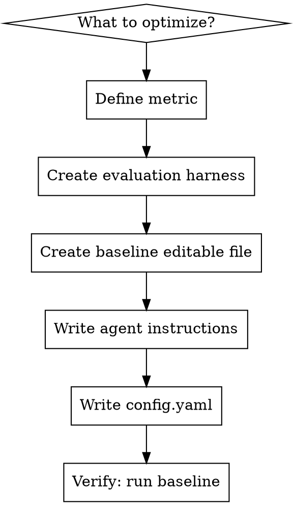

# Crucible Project Setup

Scaffold a complete crucible experiment project — config, agent instructions, editable code, and evaluation harness — so the platform can run an autonomous optimization loop.

## When to Use

- User wants to optimize something (sorting speed, model accuracy, inference latency, etc.)
- User wants to set up a new crucible experiment
- User describes a metric they want to improve automatically

## Quick Start Option

If the user's task is similar to an existing example, suggest using the CLI first:

```bash
crucible new . --list                          # see available examples
crucible new ~/my-project -e optimize-sorting  # create from example
```

Examples: `optimize-sorting`, `optimize-regression`, `optimize-classifier`, `optimize-gomoku`, `optimize-compress`, `optimize-lm`

If no example fits, proceed with the full 6-step workflow below to build from scratch.

## The Pattern

Every crucible project has exactly this structure:

```
project-root/
  .crucible/
    config.yaml      # What to optimize, how to run, what to measure
    program.md       # Instructions for the LLM agent
  <editable>.py      # Code the agent modifies (the "knob")
  <evaluation>.py    # Fixed harness that measures the metric (the "ruler")
```

**Two roles, strict separation:**
- **Editable files** = what the agent changes (algorithms, models, configs)
- **Readonly files** = how we measure (benchmarks, eval harnesses, data generators)

## Setup Workflow



### Step 1: Define the Metric and Constraints

Ask the user:
- **What are you optimizing?** (speed, accuracy, loss, score, etc.)
- **Metric name?** (e.g., `ops_per_sec`, `val_mse`, `f1_score`)
- **Direction?** `maximize` or `minimize`
- **How is it measured?** (benchmark script, eval script, test suite)
- **Dependencies?** Any third-party packages needed? (list in `requirements.txt` as readonly)
- **Architecture constraints?** Does the user require a specific approach/algorithm/architecture?

**CRITICAL — Architecture Constraints (Goodhart's Law Prevention):**

If the user specifies a required architecture (e.g., "use AlphaZero", "must use neural network", "implement with dynamic programming"), you MUST enforce it in `evaluate.py`, not just in `program.md`. Language-only constraints in prompts WILL be ignored by the agent over multiple iterations because the agent optimizes for the metric, not for following instructions.

Rule: **If the user cares about HOW it's done (not just the result), enforce the HOW in code.**

Examples of architecture constraints that need code enforcement:
- "Use MCTS + neural network" → verify NN forward passes happen during `choose_move()`
- "Must use dynamic programming" → verify memoization table is populated
- "Implement with a transformer" → verify model has attention layers
- "Use gradient descent" → verify optimizer.step() is called

### Step 2: Create the Evaluation Harness (Readonly)

The evaluation file MUST:
- Print metrics in `key: value` format, one per line
- Include the primary metric matching `metric.name` in config
- Use a fixed seed for reproducibility
- **Gate the primary metric on correctness** (zero it out if correctness fails)
- **Gate the primary metric on method compliance** (zero it out if required architecture is not used)
- Be self-contained (no external data dependencies if possible)

**Template:**

```python
"""Evaluation harness — DO NOT MODIFY.

Output format (parsed by crucible):
    <metric_name>: <float>
"""

import time
import numpy as np  # or relevant imports

SEED = 42

def generate_data():
    """Generate or load fixed test data."""
    rng = np.random.RandomState(SEED)
    # ... generate reproducible data
    return data

def verify_correctness(result, expected):
    """Return True if result is valid. Prevents metric gaming."""
    # e.g., check sorted order, check prediction shape, etc.
    return result == expected

def verify_method(editable_module):
    """Return True if the required architecture/method is used.

    Prevents the agent from bypassing architectural constraints
    to game the metric (Goodhart's Law). Language-only constraints
    in program.md WILL be ignored over multiple iterations.

    Examples of checks:
    - Neural network: verify model has expected layer types, check
      that forward() is called during inference (use a hook or counter)
    - MCTS: verify tree search nodes are created during choose_move()
    - DP: verify memoization table is populated after execution
    - Specific algorithm: inspect source with ast/inspect module
    """
    # IMPLEMENT if user specified architecture constraints.
    # If no constraints, return True.
    return True

def evaluate(result, expected, elapsed_sec=None):
    """Measure and print metrics. Gates on correctness AND method."""
    if not verify_correctness(result, expected):
        print(f"<metric_name>: 0.0")
        print("correct: false")
        return

    metric_value = ...  # compute primary metric
    print(f"<metric_name>: {metric_value:.6f}")
    print("correct: true")
    # Optional additional metrics:
    # print(f"secondary_metric: {value:.6f}")

if __name__ == "__main__":
    data = generate_data()
    import <editable_module>
    from <editable_module> import <function_name>

    # Method verification BEFORE measuring metric
    if not verify_method(<editable_module>):
        print(f"<metric_name>: 0.0")
        print("method_compliant: false")
        print("correct: false")
        # Exit early — agent must fix architecture before metric counts
        exit(0)

    t0 = time.perf_counter()
    result = <function_name>(data)
    elapsed = time.perf_counter() - t0

    print("method_compliant: true")
    evaluate(result, expected, elapsed)
```

**Key rules:**
- Output `<metric_name>: <value>` on its own line (grep-parseable)
- Use fixed random seeds everywhere
- Import the editable module's function, don't copy its code
- **Always verify correctness** — zero the metric if invalid (prevents output gaming)
- **Always verify method if architecture is constrained** — zero the metric if wrong approach (prevents method gaming / Goodhart's Law)

**Sample run.log output:**
```
ops_per_sec: 92.50
avg_ms: 10.81
correct: true
```

The platform runs `commands.eval` (e.g., `grep '^ops_per_sec:' run.log`) against this output to extract the metric value.

### Step 3: Create the Baseline Editable File

The editable file should:
- Have a simple, correct baseline implementation
- Define a clear function signature the eval harness calls
- Include a docstring explaining what the agent should optimize

**Template:**

```python
"""<Description> — this is the file the agent optimizes."""

def <function_name>(<params>) -> <return_type>:
    """<What this does>. Baseline: <simple approach>."""
    # Simple baseline implementation
    return result
```

**Key rules:**
- Start simple (built-in sort, linear regression, naive algorithm)
- The baseline MUST produce correct output
- Clear function interface that the eval harness depends on

### Step 4: Write Agent Instructions (program.md)

Structure:

```markdown
# <Task Name>

You are optimizing <what>.

## Goal

<Direction> `<metric_name>` — <what it measures>.

## Hard Rules (enforced by evaluate.py — violations zero the metric)

These constraints are verified in code by the evaluation harness.
Violating them will result in metric = 0.0.

- Edit only `<editable_file>`
- <Interface contract: function signature, input/output format>
- <Correctness requirement: eval harness verifies this>
- <Architecture constraint: e.g., "choose_move() MUST use MCTS with neural network evaluation. The eval harness checks that NN forward passes occur during move selection.">

## Soft Rules (guidelines, not code-enforced)

- <Time/resource constraints>
- <Allowed dependencies>
- <Code style preferences>

## Data / Context

<What the agent needs to know about the problem domain>

## What You Can Try

- <Approach 1 — within the required architecture>
- <Approach 2 — within the required architecture>
- <Approach 3 — within the required architecture>

## Tips

- <Non-obvious insight about the problem>
- <Known baseline performance: "Baseline <metric>: ~<value>">
```

**Good program.md traits:**
- States the goal and metric clearly
- **Separates hard rules (code-enforced) from soft rules (guidelines)** — the agent knows which constraints have teeth
- **Tells the agent that hard rules are verified by evaluate.py** — this is the key deterrent
- Suggests diverse approaches but **within the required architecture**
- Includes domain-specific tips the agent wouldn't know
- Mentions baseline performance so the agent has context

**IMPORTANT:** If the user specified architecture constraints in Step 1, they MUST appear in the "Hard Rules" section with an explicit note that evaluate.py enforces them. Do NOT put architecture constraints only in "What You Can Try" — that's a suggestion, not a rule.

### Step 5: Write config.yaml

**How commands work:**
- `commands.run` — executes the full experiment (typically runs the eval harness, which imports the editable module). Output goes to `run.log`.
- `commands.eval` — extracts the metric from `run.log` (typically a `grep` command). Must output `<metric_name>: <value>`.
- `commands.setup` (optional) — one-time setup, e.g., `pip install -r requirements.txt`

```yaml
name: "<project-name>"
description: "<one-line description>"

files:
  editable:
    - "<editable_file.py>"
  readonly:
    - "<evaluation_file.py>"

commands:
  run: "python3 <evaluation_file>.py > run.log 2>&1"
  eval: "grep '^<metric_name>:' run.log"
  # setup: "pip install -r requirements.txt"  # optional

# If training and evaluation are separate scripts, chain them and
# redirect ALL output to run.log so the eval grep can find the metric:
#   run: "(python3 train.py && python3 evaluate.py) > run.log 2>&1"
# Do NOT redirect only the last command — train.py debug output is useful
# and the metric line from evaluate.py must end up in run.log.

metric:
  name: "<metric_name>"
  direction: "<minimize|maximize>"

constraints:
  timeout_seconds: <appropriate_timeout>
  max_retries: 3

agent:
  type: "claude-code"
  instructions: "program.md"
  context_window:
    include_history: true
    history_limit: 20
    include_best: true

git:
  branch_prefix: "crucible"
  tag_failed: true
```

**Timeout guidelines:**
- Fast benchmarks (sorting, string ops): 60s
- Model training (small): 120s
- Model training (medium): 300s
- Heavy computation: 600s

**Dependencies:** If third-party packages are needed, add `requirements.txt` as a readonly file and add `setup: "pip install -r requirements.txt"` to commands. Document allowed packages in `program.md`.

### Step 6: Write README.md

Create a project README so others (and future you) understand the experiment:

```markdown
# <project-name>

<One-line description of what this experiment optimizes.>

## Setup

\```bash
# Install dependencies (if any)
pip install -r requirements.txt

# Verify baseline
python3 <evaluation_file>.py
\```

## Metric

| Name | Direction | Baseline |
|------|-----------|----------|
| `<metric_name>` | <minimize/maximize> | <baseline_value> |

## Files

- `<editable_file>` — the code the agent modifies
- `<evaluation_file>` — fixed evaluation harness (do not edit)
- `.crucible/config.yaml` — experiment configuration
- `.crucible/program.md` — agent instructions

## Run with crucible

\```bash
git init && git add -A && git commit -m 'initial'
crucible init --tag run1
crucible run --tag run1
\```
```

**Key rules:**
- Include baseline metric value (fill in after Step 7)
- List all files with their roles
- Include setup instructions if there are dependencies

### Step 7: Verify Baseline

Run the experiment manually to confirm everything works:

```bash
# 1. Run the full experiment (same as commands.run)
python3 <evaluation_file>.py > run.log 2>&1

# 2. Check output
cat run.log

# 3. Extract metric (same as commands.eval)
grep '^<metric_name>:' run.log

# 4. Record baseline
echo "Baseline <metric_name>: <value>"
```

If this works, the project is ready:

```bash
git init && git add -A && git commit -m 'initial'
crucible init --tag <name>
crucible run --tag <name>
```

## Common Experiment Types

| Type | Metric | Direction | Editable | Eval |
|------|--------|-----------|----------|------|
| Algorithm speed | `ops_per_sec` | maximize | algorithm impl | benchmark harness |
| Model accuracy | `val_mse` / `val_loss` | minimize | model code | eval on held-out data |
| Code size | `binary_size_kb` | minimize | source code | build + measure |
| Inference speed | `latency_ms` | minimize | model/inference | timing harness |
| Score/reward | `score` | maximize | agent/strategy | game/env runner |
| Memory usage | `peak_mb` | minimize | implementation | profiling harness |

## Baseline Seeding (Critical for First Run)

Crucible's `is_improvement()` returns `True` when no previous records exist, so the **first iteration always becomes "best" regardless of quality**. If the agent's first change makes things worse (common), that bad result becomes the new baseline.

**Fix: Seed results-{tag}.tsv with a baseline run before starting `crucible run`:**

```bash
# 1. Run baseline manually
python3 evaluate.py > run.log 2>&1
grep '^<metric_name>:' run.log  # e.g., val_bpb: 2.528460

# 2. Init experiment
crucible init --tag run1

# 3. Seed baseline into results-run1.tsv
COMMIT=$(git rev-parse HEAD)
echo -e "${COMMIT}\t<metric_value>\tkeep\tbaseline: <description>" >> results-run1.tsv

# 4. Now run — agent must beat the real baseline
crucible run --tag run1
```

## Agent Behavior Tuning (program.md Best Practices)

**Problem:** LLM agents tend to make too many changes at once, especially for ML experiments. A model scaled from 64-dim to 192-dim with a new optimizer, LR schedule, and context length will almost certainly perform worse because the bigger model needs proportionally more training steps.

**Guidelines for program.md:**
- **Explicitly state** the baseline's performance and training time
- **Guide incremental changes**: "Make focused, coherent changes — 2-3 related things together, not a full rewrite"
- **State compute budget**: "Baseline runs in ~10s. You have 300s budget."
- **Warn about scaling traps**: "If you increase model size, you MUST increase training steps proportionally"
- **Include framework-specific API notes** (e.g., MLX's `optim.cosine_decay` for LR schedules, not manual `optimizer.learning_rate` mutation)

**Baseline strength:** Intentionally weak baselines (fewer training steps, simpler optimizer) give the agent more room to improve. A baseline that's already near-optimal leaves no margin for the agent's early noisy iterations.

**max_retries:** Set to at least 5-10, not 3. LLM agents need multiple attempts to learn from failures. 3 retries often isn't enough for non-trivial tasks.

## Common Mistakes

- **Eval prints metric inconsistently**: Always use `print(f"{name}: {value:.6f}")` — exact format matters
- **No correctness gate**: Agent will exploit metric without correctness verification (e.g., return empty array for "fastest sort"). Always zero the metric on correctness failure.
- **Architecture constraints only in program.md (Goodhart's Law)**: If the user requires a specific architecture (e.g., "use AlphaZero MCTS+NN"), putting it only in program.md is NOT enough. The agent WILL abandon the required architecture if a simpler approach scores higher. Real example: user asked for AlphaZero, Claude replaced MCTS+NN with minimax to maximize win_rate. **Fix: enforce architecture in evaluate.py with `verify_method()` — zero the metric if the required approach isn't used.**
- **Mutable shared state**: Eval harness imports editable module at top level — use `if __name__ == "__main__"` or function-scoped imports
- **Non-deterministic eval**: Missing fixed seeds makes results noisy — agent can't tell if changes helped
- **Timeout too short**: Agent tries complex approaches that legitimately need more time — start generous, tighten later
- **program.md too vague**: "Make it better" gives no direction — list specific approaches and constraints
- **program.md doesn't distinguish hard vs soft rules**: Agent treats all instructions as suggestions. Separate "Hard Rules (code-enforced)" from "Soft Rules (guidelines)" so the agent knows which constraints have real consequences.
- **`commands.run` points to wrong file**: Should run the evaluation harness (which imports editable), not the editable file directly
- **Missing dependencies**: If agent needs third-party packages, add `requirements.txt` as readonly and `setup` command to config
