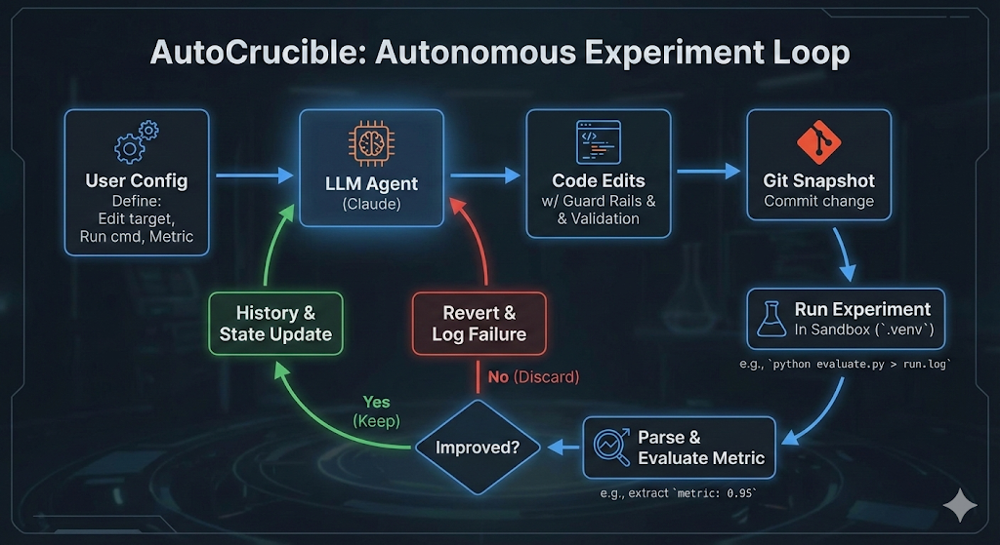

<div align="center">



# autocrucible

### 類似 [autoresearch](https://github.com/karpathy/autoresearch)，但有護欄。

[](https://pypi.org/project/autocrucible/)
[](LICENSE)

**[安裝](#安裝)** · **[快速開始](#快速開始)** · **[運作方式](#運作方式)** · **[範例](#範例)** · **[文件](#文件)**

繁體中文 | [English](README.md)

</div>

*嘗試、測量、保留有效的、丟掉沒用的——而且 agent 沒辦法作弊。*

自主實驗迴圈，agent **無法**鑽指標的漏洞。Crucible 強制檔案層級存取控制（editable / readonly / hidden）、驗證 metric 有效性、自動管理 git 歷史。Agent 只負責寫程式碼，平台控制其他一切。

## 前置需求

- **Python 3.10+**
- **[uv](https://docs.astral.sh/uv/)** — Python 套件管理器
  ```bash
  # macOS / Linux
  curl -LsSf https://astral.sh/uv/install.sh | sh

  # 或透過 Homebrew
  brew install uv
  ```
- **Git** — 平台使用 git 管理實驗版本
- **[Claude Code](https://docs.anthropic.com/en/docs/claude-code)** — 需安裝 `claude` CLI 並完成認證
  ```bash
  # 安裝
  npm install -g @anthropic-ai/claude-code

  # 認證（依照提示操作）
  claude
  ```

## 安裝

```bash
# 安裝為全域 CLI 工具
uv tool install autocrucible

# 或從本地 clone 安裝
git clone https://github.com/suzuke/autocrucible.git
uv tool install ./crucible
```

驗證：

```bash
crucible --help
```

### 更新

```bash
# 從 PyPI
uv tool install autocrucible --force

# 從本地原始碼（pull 最新後）
uv tool install ./crucible --force
```

### 開發模式

```bash
git clone https://github.com/suzuke/autocrucible.git
cd crucible
uv sync                 # 安裝到本地 .venv
uv run crucible --help  # 從原始碼執行
uv run pytest           # 執行測試
```

## 快速開始

```bash
# 從範例建立
crucible new ~/my-project -e optimize-sorting
cd ~/my-project
crucible run --tag run1
crucible run --tag run1 --max-iterations 5   # 跑 5 輪後停止

# 查看結果
crucible status --tag run1
crucible history --tag run1
crucible postmortem --tag run1

# 從最佳結果繼續（fork 前一次實驗）
crucible run --tag run2
```

用 `crucible new . --list` 列出所有範例，或 `crucible wizard` 讓 AI 生成專案。

如果實驗需要第三方套件（numpy、torch 等），在專案目錄中執行 `uv sync` 安裝。

### 執行前驗證

```bash
crucible validate
crucible validate --stability --runs 5    # 檢查指標變異度
```

### 詳細 log 輸出

```bash
crucible -v run --tag run1   # debug 級別輸出
```

## 運作原理

```
crucible run --tag run1
        │
        ▼
┌─────────────────────────────────┐
│  1. 組裝 prompt                  │  指令 + 歷史 + 狀態
│  2. Claude Agent SDK             │  agent 讀取/編輯檔案
│  3. Guard rails                  │  驗證編輯合規
│  4. Git commit                   │  快照變更
│  5. 執行實驗                      │  python evaluate.py > run.log
│  6. 解析指標                      │  grep '^metric:' run.log
│  7. 保留或丟棄                    │  改善? 保留 : reset
│  8. 循環                         │
└─────────────────────────────────┘
```

- **Agent**：使用 [Claude Agent SDK](https://github.com/anthropics/claude-agent-sdk-python)，搭配工具白名單（Read、Edit、Write、Glob、Grep）。Agent 可以讀取檔案、精準編輯和搜尋程式碼——但不能執行任意指令。
- **執行環境**：如果專案有 `.venv/`，crucible 會自動啟用它來執行實驗指令，確保 `python3 evaluate.py` 使用正確的直譯器和套件。
- **Git**：每次嘗試都會 commit。改善就推進 branch；失敗則打 tag 後 reset，保留 diff 供事後分析。

## 範例

內建範例，快速開始。從任何範例建立專案：

```bash
crucible new ~/my-project -e <範例名稱>
```

| 範例 | 指標 | 方向 | 說明 |
|------|------|------|------|
| **演算法** | | | |
| `optimize-sorting` | `ops_per_sec` | maximize | 純 Python 排序吞吐量優化 |
| `optimize-pathfind` | `nodes_explored` | minimize | 網格路徑搜尋——展示 beam 搜尋策略 |
| `optimize-hash` | `uniformity_score` | maximize | 雜湊函式均勻分佈優化 |
| `optimize-tsp` | `total_distance` | minimize | 旅行推銷員問題——200 座城市路徑優化 |
| **ML / 資料科學** | | | |
| `optimize-regression` | `val_mse` | minimize | 合成回歸（非線性交互） |
| `optimize-classifier` | `val_accuracy` | maximize | Numpy 手寫神經網路，8 類別分類 |
| `optimize-quantize` | `score` | maximize | 訓練後量化——精度 × 壓縮率權衡 |
| `optimize-lm` | `val_bpb` | minimize | 語言模型——最小化驗證集 bits per byte |
| **遊戲 AI** | | | |
| `optimize-gomoku` | `win_rate` | maximize | AlphaZero 風格五子棋 agent 訓練 |
| `optimize-snake` | `avg_score` | maximize | 貪食蛇 AI 啟發式搜尋（無外部依賴） |
| `optimize-2048` | `avg_score` | maximize | 2048 遊戲 AI，20 場固定種子對局 |
| **壓縮 / 編碼** | | | |
| `optimize-compress` | `compression_ratio` | maximize | 無損文字壓縮（禁用 zlib/gzip） |
| `optimize-tokenizer` | `tokens_per_char` | minimize | BPE 風格 tokenizer 英文壓縮 |
| `optimize-cipher` | `throughput` | maximize | 替換式加密——展示 restart 搜尋策略 |
| **數值 / 科學** | | | |
| `optimize-monte-carlo` | `error` | minimize | Monte Carlo 積分——展示穩定性驗證功能 |
| `optimize-rl-policy` | `mean_reward` | maximize | 倒單擺控制器——強化學習策略優化 |
| **Prompt 工程** | | | |
| `optimize-prompt-format` | `accuracy` | maximize | 系統提示優化——格式轉換任務 |
| `optimize-prompt-logic` | `accuracy` | maximize | 系統提示優化——邏輯推理 |
| `optimize-prompt-math` | `accuracy` | maximize | 系統提示優化——數學應用題 |
| **程式碼 / 文字** | | | |
| `optimize-codegen` | `score` | maximize | 程式碼產生器——正確性 × 速度比 |
| `optimize-regex` | `f1_score` | maximize | 正則表達式優化——Email 分類 |

### 範例展示：optimize-compress

一個展示 crucible 效果的範例——agent 從零開始建構無損文字壓縮器：

```bash
crucible new ~/compress -e optimize-compress
cd ~/compress
crucible run --tag run1
```

從 baseline RLE 壓縮器（0.51x——比不壓還差）出發，agent 通常會：
- **Iter 1**：實作 LZ77 + Huffman → ~2.63x
- **Iter 2**：加入最佳解析 DP + symbol remapping → ~2.81x（超越 zlib 的 2.65x）
- **Iter 3+**：上下文建模、算術編碼 → 3.0x+

### v0.5.0 功能展示範例

三個範例分別展示 v0.5.0 的搜尋策略與穩定性驗證功能：

#### optimize-monte-carlo — 穩定性驗證

Monte Carlo 積分估算 ∫₀¹ x² dx。每次跑都用不同的隨機樣本，指標在各次之間變動約 30–40%——正是讓單次評估不可靠的典型情境。

```bash
crucible new ~/mc -e optimize-monte-carlo
cd ~/mc
crucible validate          # 偵測 CV ~36% > 5%，自動寫入 evaluation.repeat: 3
crucible run --tag mc-v1   # 每次迭代跑 3 次，取 median
```

穩定性檢查防止 agent 追逐雜訊：沒有 `evaluation.repeat`，「運氣好」的單次跑看起來像是改善，實際上什麼都沒有進步。

#### optimize-cipher — Restart 策略

1 MB 文字的替換式加密。loop-based baseline 可以優化到 ~55 MB/s，但 `str.translate()` 可達 200+ MB/s——完全不同的方法，greedy 搜尋不會自然走到這條路。

```bash
crucible new ~/cipher -e optimize-cipher
cd ~/cipher
crucible run --tag cipher-v1
```

`plateau_threshold: 4` 觸發後，平台重置代碼並注入完整歷史。Agent 看到「loop 優化已到 ceiling」，轉而嘗試 `str.translate()`——達到 ~4× 的突破。

**核心概念：** Restart 不是「重試」。代碼重置了，但 agent 保有完整歷史，清楚知道哪些方向已經走到盡頭。

#### optimize-pathfind — Beam 策略

100 個隨機 20×20 網格迷宮的最短路徑搜尋。BFS 會走遍 40–70% 的格子；A* 搭配 Manhattan 啟發式只需 10–20%；Jump Point Search 更進一步。

```bash
crucible new ~/pathfind -e optimize-pathfind
cd ~/pathfind
crucible run --tag pathfind-v1
```

`beam_width: 3` 讓三個獨立分支探索不同演算法家族。每個 beam 都能看到其他 beam 嘗試過什麼——如果 beam-0 找到了 bidirectional BFS、beam-1 找到了 A*，beam-2 就不會浪費迭代重新實作同樣的東西。

**核心概念：** Beam 是串行執行（一次跑一個 agent），成本與迭代次數成正比。優勢是探索廣度，而非速度。

## 專案結構

```
my-experiment/
├── .crucible/
│   ├── config.yaml     # 做什麼、怎麼跑、量什麼
│   └── program.md      # 給 LLM agent 的指令
├── solution.py          # Agent 修改的程式碼（editable）
├── evaluate.py          # 固定的評估碼（hidden）
├── pyproject.toml       # 實驗依賴（不含 crucible 本身）
├── results-{tag}.jsonl  # 自動產生的實驗紀錄（每次 run 一份）
├── run.log              # 最新一次實驗輸出
└── logs/                # 每次迭代的 log
    └── iter-1/
        ├── agent.txt    # Agent 推理過程
        └── run.log      # 實驗輸出
```

Crucible 安裝為**全域 CLI 工具**——它不是你實驗專案的依賴。專案的 `pyproject.toml` 只列出實驗所需的套件（numpy、torch 等）。

## 文件

- [設定檔參考](docs/CONFIG.zh-TW.md) — 所有 YAML 欄位、eval 慣例、git 策略、防護機制
- [FAQ](docs/FAQ.zh-TW.md) — 局部最優、單一指標、平行 agent、安全性、監控
- [Changelog](docs/CHANGELOG.md) — 版本歷史與發行說明
